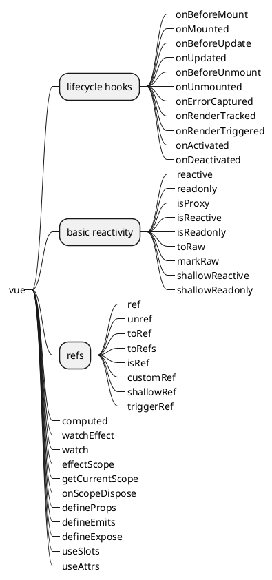

[toc]



# vue

## Application API

> 改变全局 vue 行为
> `const app = createApp({})`

1. ```typescript
   app.version: string
   ```
1. ```typescript
   app.config: AppConfig
   ```
   > ### Application Config
   >
   > `const config = createApp({}).config`
   > app 级别的设置，挂载前配置
   1. ```typescript
      readonly config.isNativeTag?: (tag: string) => boolean
      ```
   1. ```typescript
      config.performance: boolean
      ```
   1. ```typescript
      config.optionMergeStrategies: Record<string, OptionMergeFunction>
      ```
   1. ```typescript
      config.globalProperties: Record<string, any>
      ```
   1. ```typescript
      config.errorHandler?: (err: unknown, instance:  ComponentPublicInstance | null, info: string) => void
      ```
   1. ```typescript
      config.warnHandler?: (msg: string, instance: ComponentPublicInstance | null, trace: string) => void
      ```
   1. ```typescript
      config.compilerOptions: RuntimeCompilerOptions
      ```
1. ```typescript
   app.use(plugin: Plugin_2, ...options: any[]): this
   ```
1. ```typescript
   app.mixin(mixin: ComponentOptions): this
   ```
1. ```typescript
   app.component(name: string): Component | undefined
   app.component(name: string, component: Component): thi;
   ```
1. ```typescript
   app.directive(name: string): Directive | undefined
   app.directive(name: string, directive: Directive): this
   ```
1. ```typescript
   app.mount(rootContainer: HostElement | string, isHydrate?: boolean, isSVG?: boolean): ComponentPublicInstance
   ```
1. ```typescript
   app.unmount(): void
   ```
1. ```typescript
   app.provide<T>(key: InjectionKey<T> | string, value: T): this
   ```
1. ```typescript
   app._uid: number
   ```
1. ```typescript
   app._component: ConcreteComponent
   ```
1. ```typescript
   app._props: Data | null
   ```
1. ```typescript
   app._container: HostElement | null
   ```
1. ```typescript
   app._context: AppContext
   ```
1. ```typescript
   app._instance: ComponentInternalInstance | null
   ```
1. ```typescript
   app.filter?(name: string): Function | undefined
   app.filter?(name: string, filter: Function): this
   ```

## Global API

1. ```typescript
   createApp(rootComponent: Component, rootProps?: Data | null) => App<HostElement>
   ```
1. ```typescript
   h(type: string, children?: RawChildren): VNode
   h(type: string, props?: RawProps | null, children?: RawChildren | RawSlots): VNode
   h(type: typeof Text_2 | typeof Comment_2, children?: string | number | boolean): VNode
   h(type: typeof Text_2 | typeof Comment_2, props?: null, children?: string | number | boolean): VNode
   h(type: typeof Fragment, children?: VNodeArrayChildren): VNode
   h(type: typeof Fragment, props?: RawProps | null, children?: VNodeArrayChildren): VNode
   h(type: typeof Teleport, props: RawProps & TeleportProps, children: RawChildren): VNode
   h(type: typeof Suspense, children?: RawChildren): VNode
   h(type: typeof Suspense, props?: (RawProps & SuspenseProps) | null, children?: RawChildren | RawSlots): VNode
   h<P, E extends EmitsOptions = {}>(type: FunctionalComponent<P, E>, props?: (RawProps & P) | ({} extends P ? null : never), children?: RawChildren | RawSlots): VNode
   h(type: Component, children?: RawChildren): VNode
   h<P>(type: ConcreteComponent | string, children?: RawChildren): VNode
   h<P>(type: ConcreteComponent<P> | string, props?: (RawProps & P) | ({} extends P ? null : never), children?: RawChildren): VNode
   h(type: Component, props: null, children?: RawChildren | RawSlots): VNode
   h<P>(type: ComponentOptions<P>, props?: (RawProps & P) | ({} extends P ? null : never), children?: RawChildren | RawSlots): VNode
   h(type: Constructor, children?: RawChildren): VNode
   h<P>(type: Constructor<P>, props?: (RawProps & P) | ({} extends P ? null : never), children?: RawChildren | RawSlots): VNode
   h(type: DefineComponent, children?: RawChildren): VNode
   h<P>(type: DefineComponent<P>, props?: (RawProps & P) | ({} extends P ? null : never), children?: RawChildren | RawSlots): VNode
   ```
1. ```typescript
   defineComponent<Props, RawBindings = object>(setup: (props: Readonly<Props>, ctx: SetupContext) => RawBindings | RenderFunction): DefineComponent<Props, RawBindings>
   defineComponent<Props = {}, RawBindings = {}, D = {}, C extends ComputedOptions = {}, M extends MethodOptions = {}, Mixin extends ComponentOptionsMixin = ComponentOptionsMixin, Extends extends ComponentOptionsMixin = ComponentOptionsMixin, E extends EmitsOptions = EmitsOptions, EE extends string = string>(options: ComponentOptionsWithoutProps<Props, RawBindings, D, C, M, Mixin, Extends, E, EE>): DefineComponent<Props, RawBindings, D, C, M, Mixin, Extends, E, EE>
   defineComponent<PropNames extends string, RawBindings, D, C extends ComputedOptions = {}, M extends MethodOptions = {}, Mixin extends ComponentOptionsMixin = ComponentOptionsMixin, Extends extends ComponentOptionsMixin = ComponentOptionsMixin, E extends EmitsOptions = Record<string, any>, EE extends string = string>(options: ComponentOptionsWithArrayProps<PropNames, RawBindings, D, C, M, Mixin, Extends, E, EE>): DefineComponent<Readonly<{
    [key in PropNames]?: any}>, RawBindings, D, C, M, Mixin, Extends, E, EE>
   defineComponent<PropsOptions extends Readonly<ComponentPropsOptions>, RawBindings, D, C extends ComputedOptions = {}, M extends MethodOptions = {}, Mixin extends ComponentOptionsMixin = ComponentOptionsMixin, Extends extends ComponentOptionsMixin = ComponentOptionsMixin, E extends EmitsOptions = Record<string, any>, EE extends string = string>(options: ComponentOptionsWithObjectProps<PropsOptions, RawBindings, D, C, M, Mixin, Extends, E, EE>): DefineComponent<PropsOptions, RawBindings, D, C, M, Mixin, Extends, E, EE>
   ```
1. ```typescript
   defineAsyncComponent<T extends Component = {
    new (): ComponentPublicInstance;
   }>(source: AsyncComponentLoader<T> | AsyncComponentOptions<T>): T
   ```
1. ```typescript
   defineCustomElement<Props, RawBindings = object>(setup: (props: Readonly<Props>, ctx: SetupContext) => RawBindings | RenderFunction): VueElementConstructor<Props>
   defineCustomElement<Props = {}, RawBindings = {}, D = {}, C extends ComputedOptions = {}, M extends MethodOptions = {}, Mixin extends ComponentOptionsMixin = ComponentOptionsMixin, Extends extends ComponentOptionsMixin = ComponentOptionsMixin, E extends EmitsOptions = EmitsOptions, EE extends string = string>(options: ComponentOptionsWithoutProps<Props, RawBindings, D, C, M, Mixin, Extends, E, EE> & {
    styles?: string[];
   }): VueElementConstructor<Props>
   defineCustomElement<PropNames extends string, RawBindings, D, C extends ComputedOptions = {}, M extends MethodOptions = {}, Mixin extends ComponentOptionsMixin = ComponentOptionsMixin, Extends extends ComponentOptionsMixin = ComponentOptionsMixin, E extends EmitsOptions = Record<string, any>, EE extends string = string>(options: ComponentOptionsWithArrayProps<PropNames, RawBindings, D, C, M, Mixin, Extends, E, EE> & {
    styles?: string[];
   }): VueElementConstructor<{
    [K in PropNames]: any;
   }>
   defineCustomElement<PropsOptions extends Readonly<ComponentPropsOptions>, RawBindings, D, C extends ComputedOptions = {}, M extends MethodOptions = {}, Mixin extends ComponentOptionsMixin = ComponentOptionsMixin, Extends extends ComponentOptionsMixin = ComponentOptionsMixin, E extends EmitsOptions = Record<string, any>, EE extends string = string>(options: ComponentOptionsWithObjectProps<PropsOptions, RawBindings, D, C, M, Mixin, Extends, E, EE> & {
    styles?: string[];
   }): VueElementConstructor<ExtractPropTypes<PropsOptions>>
   defineCustomElement(options: {
    new (...args: any[]): ComponentPublicInstance;
   }): VueElementConstructor
   ```
1. ```typescript
   resolveComponent(name: string, maybeSelfReference?: boolean): ConcreteComponent | string
   ```
1. ```typescript
   resolveDynamicComponent(component: unknown): VNodeTypes
   ```
1. ```typescript
   resolveDirective(name: string): Directive | undefined
   ```
1. ```typescript
   withDirectives<T extends VNode>(vnode: T, directives: DirectiveArguments): T
   ```
1. ```typescript
   createRenderer<HostNode = RendererNode, HostElement = RendererElement>(options: RendererOptions<HostNode, HostElement>): Renderer<HostElement>
   ```
1. ```typescript
   nextTick<T = void>(this: T, fn?: (this: T) => void): Promise<void>
   ```
1. ```typescript
   mergeProps(...args: (Data & VNodeProps)[]): Data
   ```
1. ```typescript
   useCssModule(name?: string): Record<string, string>
   ```
1. ```typescript
   const version: string
   ```

## Directives

1. ```html
   <!-- 使用这种方式进行插值则不能在给元素添加子元素，包括文本 -->
   <!-- 只能在传值的时候进行dynamic和static的拼接 -->
   <!-- 插入文本 -->
   <tag v-text="string"></tag>
   ```
1. ```html
   <!-- 使用这种方式进行插值则不能在给元素添加子元素，包括文本 -->
   <!-- 只能在传值的时候进行dynamic和static的拼接 -->
   <!-- 插入html -->
   <tag v-html="string"></tag>
   ```
1. ```html
   <tag v-show="boolean"></tag>
   ```
1. ```html
   <tag v-if="boolean"></tag>
   <tag v-else-if="boolean"></tag>
   <tag v-else="boolean"></tag>
   ```
1. ```html
   <tag v-for="(v, k) of number string | Array | Iterable" :key="string"></tag>
   <tag v-for="(v, k, i) of Object" :key="string"></tag>
   ```
1. ```html
   <!-- // TODO 下面的解释真的是正确的？？？ -->
   <!-- @[dynamicEvt] @[dynamicEvt].modifier 这里的动态事件名不能带修饰符，因为动态事件名可能是对象传入 -->
   <tag v-on="Function | Inline Statement | Object"></tag>
   <!--
     .stop
     .prevent
     .capture
     .self
     .{keyAlias}
     .once
     .left
     .right
     .middle
     .passive
    -->
   ```
1. ```html
   <tag v-bind="any | Object"></tag>
   <!--
     .caml
     .prop
     .attr
    -->
   ```
1. ```html
   <!-- 自定义时value和emit的命名必须如下，否则警告且无效 -->
   <!-- modeValue update:modelValue -->
   <tag v-model="unknown"></tag>
   <!--
     .lazy
     .number
     .trim
    -->
   ```
1. ```html
   <tag v-slot="unknown"></tag>
   ```
1. ```html
   <tag v-pre></tag>
   ```
1. ```html
   <tag v-cloak></tag>
   ```
1. ```html
   <tag v-once></tag>
   ```
1. ```html
   <tag v-memo="Array"></tag>
   ```

## Special Attributes

1. ```html
   <tag :key="number | string | symbol"></tag>
   ```
1. ```html
   <tag ref="string | Function"></tag>
   ```
1. ```html
   <tag :is="string | Object"></tag>
   ```

## Built-In Components

1. ```html
   <component :is="string | Component | VNode"></component>
   ```
1. ```html
   <transition
     name="string"
     appear="boolean"
     persisted="boolean"
     css="boolean"
     type="'transition' | 'animation'"
     mode="'default' | 'out-in' | 'in-out'"
     duration="number | { enter: number, leave: number }"
     enter-from-class="string"
     leave-from-class="string"
     appear-class="string"
     enter-to-class="string"
     leave-to-class="string"
     appear-to-class="string"
     enter-active-class="string"
     leave-active-class="string"
     appear-active-class="string"
     @before-enter="Function"
     @before-leave="Function"
     @enter="Function"
     @leave="Function"
     @appear="Function"
     @after-enter="Function"
     @after-leave="Function"
     @enter-cancelled="Function"
     @leave-cancelled="Function"
     @appear-cancelled="Function"
   ></transition>
   ```
1. ```html
   <transition-group
     tag="string"
     move-class="string"
     name="string"
     appear="boolean"
     persisted="boolean"
     css="boolean"
     type="'transition' | 'animation'"
     duration="number | { enter: number, leave: number }"
     enter-from-class="string"
     leave-from-class="string"
     appear-class="string"
     enter-to-class="string"
     leave-to-class="string"
     appear-to-class="string"
     enter-active-class="string"
     leave-active-class="string"
     appear-active-class="string"
     @before-enter="Function"
     @before-leave="Function"
     @enter="Function"
     @leave="Function"
     @appear="Function"
     @after-enter="Function"
     @after-leave="Function"
     @enter-cancelled="Function"
     @leave-cancelled="Function"
     @appear-cancelled="Function"
   ></transition-group>
   ```
1. ```html
   <keep-alive
     include="string | RegExp | Array"
     exclude="string | RegExp | Array"
     max="number | string"
   ></keep-alive>
   ```
1. ```html
   <slot name="string"></slot>
   ```
1. ```html
   <teleport to="string" disabled="boolean"></teleport>
   ```

## Reactivity API

### Basic Reactivity APIs

1. ```typescript
   // deep所有项都是相应式
   // 不可以是纯量
   reactive<T extends object>(target: T): UnwrapNestedRefs<T>
   ```
1. ```typescript
   // deep所有项都是只读
   readonly<T extends object>(target: T): DeepReadonly<UnwrapNestedRefs<T>>
   ```
1. ```typescript
   // deep所有非纯量项都是reactive/readonly代理过的
   isProxy(value: unknown): boolean
   ```
1. ```typescript
   // deep所有非纯量项都是reactive代理过的
   isReactive(value: unknown): boolean
   ```
1. ```typescript
   // deep所有非纯量项都是readonly代理过的
   isReadonly(value: unknown): boolean
   ```
1. ```typescript
   // deep的返回所有reactive/readonly代理过的原始obj
   toRaw<T>(observed: T): T
   ```
1. ```typescript
   // 返回原始对象，阻止被reactive/readonly代理
   // 被代理时不会报错，但没用
   markRaw<T extends object>(value: T): T
   ```
1. ```typescript
   // shallow的进行第一层纯量的相应式
   shallowReactive<T extends object>(target: T): ShallowReactive<T>
   ```
1. ```typescript
   // shallow的进行第一层纯量的只读
   shallowReadonly<T extends object>(target: T): Readonly<{
    [K in keyof T]: UnwrapNestedRefs<T[K]>
   ```

### Refs

1. ```typescript
   ref<T extends object>(value: T): [T] extends [Ref] ? T : Ref<UnwrapRef<T>>
   ref<T>(value: T): Ref<UnwrapRef<T>>
   ref<T = any>(): Ref<T | undefined>
   ```
1. ```typescript
   unref<T>(ref: T | Ref<T>): T
   ```
1. ```typescript
   toRef<T extends object, K extends keyof T>(object: T, key: K): ToRef<T[K]>
   ```
1. ```typescript
   toRefs<T extends object>(object: T): ToRefs<T>
   ```
1. ```typescript
   isRef<T>(r: Ref<T> | unknown): r is Ref<T>
   ```
1. ```typescript
   customRef<T>(factory: CustomRefFactory<T>): Ref<T>
   ```
1. ```typescript
   shallowRef<T extends object>(value: T): T extends Ref ? T : ShallowRef<T>
   shallowRef<T>(value: T): ShallowRef<T>
   shallowRef<T = any>(): ShallowRef<T | undefined>
   ```
1. ```typescript
   triggerRef(ref: Ref): void
   ```

### Computed and Watch

1. ```typescript
   computed<T>(getter: ComputedGetter<T>, debugOptions?: DebuggerOptions): ComputedRef<T>
   computed<T>(options: WritableComputedOptions<T>, debugOptions?: DebuggerOptions): WritableComputedRef<T>
   ```
1. ```typescript
   // 监听以对新旧值进行操作
   watch<T extends MultiWatchSources, Immediate extends Readonly<boolean> = false>(sources: [...T], cb: WatchCallback<MapSources<T, false>, MapSources<T, Immediate>>, options?: WatchOptions<Immediate>): WatchStopHandle
   watch<T extends Readonly<MultiWatchSources>, Immediate extends Readonly<boolean> = false>(source: T, cb: WatchCallback<MapSources<T, false>, MapSources<T, Immediate>>, options?: WatchOptions<Immediate>): WatchStopHandle
   watch<T, Immediate extends Readonly<boolean> = false>(source: WatchSource<T>, cb: WatchCallback<T, Immediate extends true ? T | undefined : T>, options?: WatchOptions<Immediate>): WatchStopHandle
   watch<T extends object, Immediate extends Readonly<boolean> = false>(source: T, cb: WatchCallback<T, Immediate extends true ? T | undefined : T>, options?: WatchOptions<Immediate>): WatchStopHandle
   ```
1. ```typescript
   // 监听以对var进行操作
   watchEffect(effect: WatchEffect, options?: WatchOptionsBase): WatchStopHandle
   ```
1. ```typescript
   watchPostEffect(effect: WatchEffect, options?: DebuggerOptions): WatchStopHandle
   ```
1. ```typescript
   watchSyncEffect(effect: WatchEffect, options?: DebuggerOptions): WatchStopHandle
   ```

### Effect Scope API

1. ```typescript
   effectScope(detached?: boolean): EffectScope
   ```
1. ```typescript
   getCurrentScope(): EffectScope | undefined
   ```
1. ```typescript
   onScopeDispose(fn: () => void): void
   ```

## Composition API

1. ```typescript
   provide<T>(key: InjectionKey<T> | string | number, value: T): void
   ```
1. ```typescript
   inject<T>(key: InjectionKey<T> | string): T | undefined
   inject<T>(key: InjectionKey<T> | string, defaultValue: T, treatDefaultAsFactory?: false): T
   inject<T>(key: InjectionKey<T> | string, defaultValue: T | (() => T), treatDefaultAsFactory: true): T
   ```
1. ```typescript
   getCurrentInstance: () => ComponentInternalInstance | null
   ```

### Lifecycle Hooks

1. ```typescript
   onBeforeMount(hook: () => any, target?: ComponentInternalInstance | null) => false | Function | undefined
   ```
1. ```typescript
   onMounted(hook: () => any, target?: ComponentInternalInstance | null) => false | Function | undefined
   ```
1. ```typescript
   onBeforeUpdate(hook: () => any, target?: ComponentInternalInstance | null) => false | Function | undefined
   ```
1. ```typescript
   onUpdated(hook: () => any, target?: ComponentInternalInstance | null) => false | Function | undefined
   ```
1. ```typescript
   onBeforeUnmount(hook: () => any, target?: ComponentInternalInstance | null) => false | Function | undefined
   ```
1. ```typescript
   onUnmounted(hook: () => any, target?: ComponentInternalInstance | null) => false | Function | undefined
   ```
1. ```typescript
   onErrorCaptured<TError = Error>(hook: ErrorCapturedHook<TError>, target?: ComponentInternalInstance | null): void
   ```
1. ```typescript
   onRenderTracked(hook: DebuggerHook, target?: ComponentInternalInstance | null) => false | Function | undefined
   ```
1. ```typescript
   onRenderTriggered(hook: DebuggerHook, target?: ComponentInternalInstance | null) => false | Function | undefined
   ```
1. ```typescript
   onActivated(hook: Function, target?: ComponentInternalInstance | null): void
   ```
1. ```typescript
   onDeactivated(hook: Function, target?: ComponentInternalInstance | null): void
   ```

## Single File Components

### `<script setup>`

1. ```typescript
   defineProps<PP extends ComponentObjectPropsOptions = ComponentObjectPropsOptions>(props: PP): Readonly<ExtractPropTypes<PP>>
   defineProps<TypeProps>(): Readonly<TypeProps>
   ```
1. ```typescript
   defineEmits<EE extends string = string>(emitOptions: EE[]): EmitFn<EE[]>
   defineEmits<E extends EmitsOptions = EmitsOptions>(emitOptions: E): EmitFn<E>
   defineEmits<TypeEmit>(): TypeEmit
   ```
1. ```typescript
   defineExpose(exposed?: Record<string, any>): void
   ```

1. ```typescript
   // 所有slot的顺序是定义时确定
   // 当#['name']中的名字与#name重复时，#['name']会有更高的优先级；动态插槽与静态插槽同时使用，当静态插槽名在动态插槽也匹配到时，动态插槽起作用；能使用动态插槽就不要使用静态插槽
   useSlots(): SetupContext['slots']
   ```

1. ```typescript
   useAttrs(): SetupContext['attrs']
   ```

1. ```typescript
   withDefaults<Props, Defaults extends InferDefaults<Props>>(props: Props, defaults: Defaults): PropsWithDefaults<Props, Defaults>
   ```

---

# vue-router

## `<router-link>`Props

1. ```html
   <router-link
     to="string | RouteLocationRaw"
     replace="boolean = false"
     active-class="string = router-link-active"
     exact-active-class="string = router-link-exact-active"
     aria-current-value="'page' | 'step' | 'location' | 'date' | 'true' | 'false' = 'page'"
     custom="boolean = false"
     v-slot="{ href, route, navigate, isActive, isExactActive }"
   ></router-link>
   ```

## `<router-view>`Props

1. ```html
   <router-view
     name="string = default"
     route="RouteLocationNormalized"
     v-slot="{ Component, route }"
   ></router-view>
   ```

## createRouter

1. ```typescript
   createRouter(options: RouterOptions = {
     history: RouterHistory,
     linkActiveClass?: string,
     linkExactActiveClass?: string,
     parseQuery?: (searchQuery: string) => Record<string, (string | null)[] | string | null>,
     routes: RouteRecordRaw[] = [
       {
         path: string,
         redirect?: RouteLocationRaw | (to: RouteLocationNormalized) => RouteLocationRaw,
         children?: RouteRecordRaw[],
         alias?: string | string[],
         name?: string | symbol,
         beforeEnter?: NavigationGuard | NavigationGuard[],
         props?: boolean | Record<string, any> | (to: RouteLocationNormalized) => Record<string, any>,
         meta?: RouteMeta
       }
     ],
     scrollBehavior?: RouterScrollBehavior,
     stringifyQuery?: (
       query: Record<
         string | number,
         string | number | null | undefined | (string | number | null | undefined)[]
       >
     ) => string
   }): Router
   ```

## createWebHistory

1. ```typescript
   createWebHistory(base?: string): RouterHistory
   ```

## createWebHashHistory

1. ```typescript
   createWebHashHistory(base?: string): RouterHistory
   ```

## createMemoryHistory

1. ```typescript
   createMemoryHistory(base?: string): RouterHistory
   ```

## NavigationFailureType

1. ```typescript
   enum NavigationFailureType {
     aborted = 4,
     cancelled = 8,
     duplicated = 16
   }
   ```

## START_LOCATION

1. ```typescript
   const START_LOCATION: RouteLocationNormalizedLoaded
   ```

## Composition API

1. ```typescript
   onBeforeRouteLeave(leaveGuard: NavigationGuard): void
   ```
1. ```typescript
   onBeforeRouteUpdate(updateGuard: NavigationGuard): void
   ```
1. ```typescript
   useLink(props: RouterLinkOptions): {
     route: ComputedRef<RouteLocationNormalized & { href: string }>,
     href: ComputedRef<string>,
     isActive: ComputedRef<boolean>,
     isExactActive: ComputedRef<boolean>,
     navigate: (event?: MouseEvent) => Promise(NavigationFailure | void),
   }
   ```
1. ```typescript
   useRoute(): RouteLocationNormalized
   ```
1. ```typescript
   useRouter(): Router
   ```

## Router Properties

1. ```typescript

   ```

## Router Methods

1. ```typescript
   addRoute(parentName: string | symbol, route: RouteRecordRaw): () => void
   addRoute(route: RouteRecordRaw): () => void
   ```
1. ```typescript
   afterEach(guard: NavigationHookAfter): () => void
   ```
1. ```typescript
   back(): void
   ```
1. ```typescript
   beforeEach(guard: NavigationGuard): () => void
   ```
1. ```typescript
   beforeResolve(guard: NavigationGuard): () => void
   ```
1. ```typescript
   forward(): void
   ```
1. ```typescript
   getRoutes(): RouteRecord[]
   ```
1. ```typescript
   go(delta: number): void
   ```
1. ```typescript
   hasRoute(name: string | symbol): boolean
   ```
1. ```typescript
   isReady(): Promise<void>
   ```
1. ```typescript
   onError(handler: (error: any, to: RouteLocationNormalized, from: RouteLocationNormalized) => any): () => void
   ```
1. ```typescript
   push(to: RouteLocationRaw): Promise<NavigationFailure | void | undefined>
   ```
1. ```typescript
   removeRoute(name: string | symbol): void
   ```
1. ```typescript
   replace(to: RouteLocationRaw): Promise<NavigationFailure | void | undefined>
   ```
1. ```typescript
   resolve(to: RouteLocationRaw): RouteLocation & {
     href: string
   }
   ```

## RouteRecordNormalized

1. ```typescript
   // 不知道用在哪里
   ```

## RouteLocationRaw

1. ```typescript
   // 不知道用在哪里
   ```

## RouteLocation

1. ```typescript
   // 不知道用在哪里
   ```

## RouteLocationNormalized

1. ```typescript
   // 不知道用在哪里
   ```

## NavigationFailure

1. ```typescript
   // 不知道用在哪里
   ```

## NavigationGuard

1. ```typescript
   // mark
   ```

## Component Enabled Options

1. ```typescript
   // mark
   ```

# Vue Test Utils

## mount

1. ```typescript
   mount(
     Component,
     options?: MountingOptions<Props, Data = {}> {
       attachTo?: HTMLElement | string
       attrs?: Record<string, unknown>
       data?: () => {} extends Data ? any : Data extends object ? Partial<Data> : any
       props?: (RawProps & Props) | ({} extends Props ? null : never)
       slots?: { [key: string]: Slot } & { default?: Slot }
       global?: GlobalMountOptions
       shallow?: boolean
    }
   ): VueWrapper
   ```

````
## Wrapper methods
1. ```typescript

````
